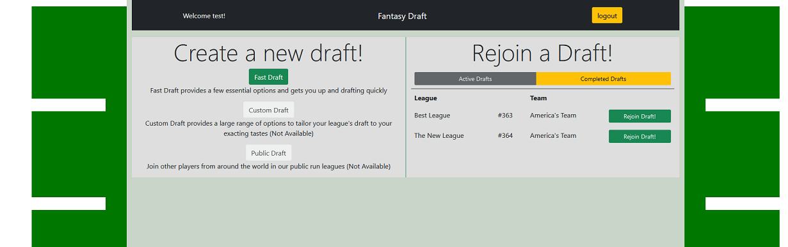
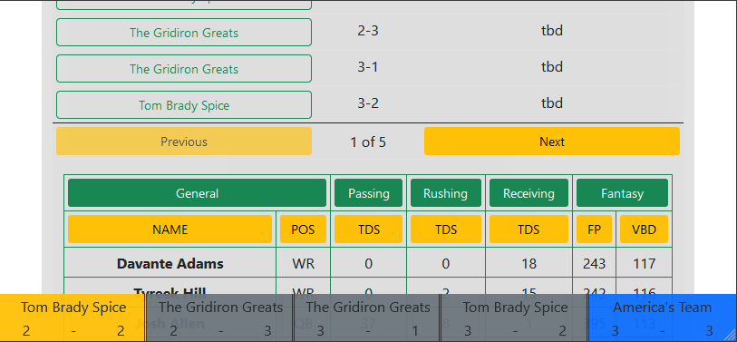
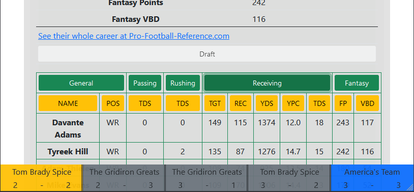
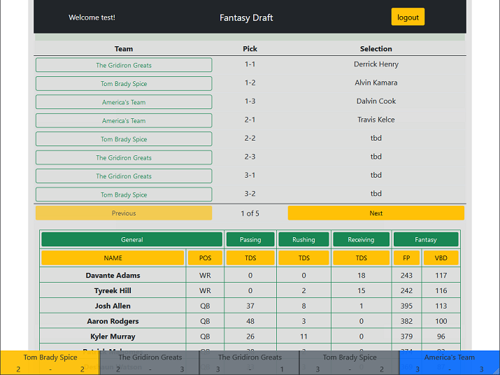
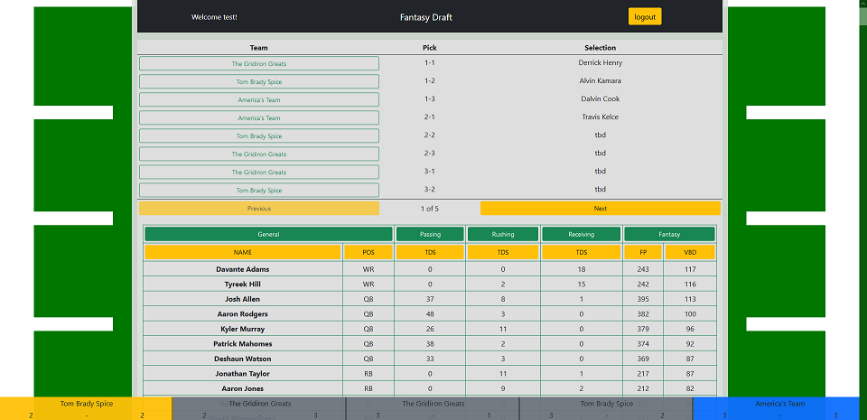

# FantasyDraft Prototype

## A Fantasy Football Draft App Written in Django and React

FantasyDraft is a mock-up of a fantasy football draft website, which allows users to create accounts, to invite friends to leagues, to draft in real time, leave and rejoin active drafts and view the results of a completed drafts.  Utilizing React and Django-Channels, FantasyDraft can serve this experience as an SPA, providing a streamlined experience with minimal loading times.  The Bootstrap CSS framework is utilized to give a modern sheen to our user interface, with a few tweaks in a custom style class.

### Key Features
* Responsive design across a variety of screen dimensions.
* 'Live' drafting, your browser updates as you and other players in your league progress through the draft. 
* Sortable, collapsable tables featuring NFL players and all their fantasy stats.
* Persistant draft rooms, which can be rejoined after closing browser or losing internet connection.

### Demonstration.
A video demonstrating the abilities of FantasyDraft can be seen [on Youtube](https://youtu.be/TAqgxlCbyzQ).

>FantasyDraft Draft on iPhone 12 Mini

>Partially Expanded Table on iPhone 12 Mini

### Backend
Built using Python's Django framework, the backend is a minimalist approach to building an api which directly satisfies that goals of FantasyDraft.  Django-Channels was also utilized to allow the Websocket protocol to provide real time updates to all users in a draft as their draft proceeds.  

### Frontend
Most of the core logic of FantasyDraft resides in the React application, where several complex components are composited to create the larger draft experience.  JSX and React Hooks were used to create the core rendering, while the Bootstrap CSS framework provided the scaffolding for the styling.

>FantasyDraft on iPad

### Technical Directory
#### Backend
* draft/views.py
>Basic requests used to authenticate users and build a draft.
* draft/models.py
>Models used to represent a fantasy league, teams and players, as well as the draft relationship between fantasy teams and players.
* draft/consumers.py
>Backend websocket implementation for the live draft instance, contains player selection and user activity logic.

#### Frontend
* draft/static/draft/lobby.js
>Houses the base React App as well as the landing page and fast draft creation logic
* draft/static/draft/logincontrol.js
>User authentication components.
* draft/static/draft/draft.js
>Contains the base materials for the draft experience, including the websocket connection as well as the integral draft functions.
* draft/static/draft/draft*.js
>These three files contain the logic for the three big components of the draft, the informative draft board, the selectable and sortable draft pool and the draft order, which acts as a preview for upcoming picks as well as displays other users' status in the draft.

#### Note on Django-channels
Django channels has an open issue regarding requests which fail due to 'deadlock on the single executor thread' which requires FantasyDraft to bundle an older version of ASGIRef.  Just for thoroughness I'm including the issue link: https://github.com/django/channels/issues/1722 as well as the StackOverflow answer that lead to the ASGIRef requirement: https://stackoverflow.com/questions/68208931/django-runtimeerror-at-admin-users-user-1-change-single-thread-executor-alrea.

